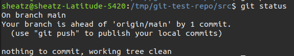

============
Git tutorial
============

:Authors: Guillaume Oliviéro
:Date:    2023-02-17
:Contact: oliviero@cenbg.in2p3.fr

.. contents:: Table of Contents

Goal of the tutorial
====================

- Set-up git SSH keys for cloning and push
- Learn the git flow
- Learn how to use properly a git repository
- Understand the branching concepts

Introduction
============

What is git?
------------

``Oh  baby, don't  loose me.  Don't  loose me.  No more``.   Git is  a
powerful and free versioning system usually used for coordinating work
among  programmers  collaboratively   developing  source  code  during
software development.

Why using git?
--------------

- Backup and save your work
- Powerful version system if you want to roll back
- Most used collaborative tool for code
- You can use  it for your codes, manuals BUT  also your presentations
  AND your thesis ;)

Set-up SSH keys
===============

You must follow this small github documentation guide:

https://docs.github.com/en/authentication/connecting-to-github-with-ssh/generating-a-new-ssh-key-and-adding-it-to-the-ssh-agent#generating-a-new-ssh-key

Bash commands

.. code:: sh

   $ ssh-keygen -t ed25519 -C "your_email@example.com"

   $ eval "$(ssh-agent -s)"

   $ open ~/.ssh/config

   $ touch ~/.ssh/config # if the config file doesn't exist

   $ ssh-add --apple-use-keychain ~/.ssh/id_ed25519
..

Now instead of using HTTPS to clone a repository OR each time you want
to commit something, it will be done through SSH keys.

Git step-by-step
================

Step 1: Creating your first repository on the github interface
--------------------------------------------------------------

.. figure:: img/step_1_repo.png
   :width: 1800

   Under your account, click on Repositories and New

.. figure:: img/step_1_create_repo.png
   :width: 1800

   Give a  name and a short  description to your repository.  Tick the
   ``Add  a README  file`` box  and choose  a convenient  License. GNU
   General Public License can be chosen.

Step 2: Cloning your repository
-------------------------------

Cloning your new repository into your ``/home/user/~``:

.. code:: sh

   $ cd ~
   $ git clone https://github.com/goliviero/git-test-repo.git
   $ cd git-test-repo/\
..

.. figure:: img/step_2_clone_ssh.png
   :width: 1800

   Cloning using SSH keys.

Step 3: Stage new files
-----------------------

Creating a src directory:

.. code:: sh

   $ mkdir src/
..

Creating an empty cxx program:

.. code:: sh

   $ touch src/test.cxx
..

See the status of your repository:

.. code:: sh

   $ git status
..

.. figure:: img/step_3_git_status.png
   :width: 1800

   Git status initial before stage and commit.

Adding your  first CPP program  to your repository. We  will ``stage``
(track) the file we want:

.. code:: sh

   $ git add src/test.cxx
..

See the status again of your repository:

.. code:: sh

   $ git status
..

   Git status after ``git add`` while staged.

Step 4: Commit new staged files
-------------------------------

Commit your new file:

.. code:: sh

   $ git commit -m "Add a test cpp program to my repository"
..

   Git status after ``git commit`` and before the push.

The ``-m`` option allows you to do an inline commit message. Otherwise
it  will open  an editor  inside the  terminal but  you can  give more
details about your commit.

HOW TO RIGHT A GOOD COMMIT MESSAGE - few recommandations:
.........................................................

- Keep it short
- Use the imperative mood
- Add a short title
- Add a body (explain WHAT the change is, but especially WHY the change was needed)

- Good examples:

  - `Enable Logging Globally`
  - `Add Account Delete Route`
       `Needed for account deletion workflow on frontend`

- Bad examples:

  - `debugging`
  - `update`
  - `I've added a delete route to the accounts controller`

Step 5: Push files remotely
---------------------------

Push the file to the remote repository:

.. code:: sh

   $ git push
..

screen

Your file has been pushed to your ``main`` branch.

Step 6: Create a new branch and push it
---------------------------------------

screen drawing

Creating a  new branch  for a  dedicated feature. Here  we will  add 2
empty classes in our src directory.

First we have to create the new branch ``feature_add_classes``.

.. code:: sh

   $ git checkout -b feature_add_classes
..

the ``-b``  option allow us to  create a branch and  switch (i.e ``git
checkout``) directly on it.

screen

Switch back to master branch

.. code:: sh

   $ git checkout main
..

Then create the 2 empty classes named ``foo`` and ``bar``

.. code:: sh

   $ cd src
   $ touch foo.cpp foo.hpp bar.cpp bar.hpp
..

Stage all file in the src directory at once:

.. code:: sh

   $ git add *
..

Before   commit,   check   we   are  in   the   right   branch   (i.e:
feature_add_classes):

.. code:: sh

   $ git branch
..

screen

Commit the classes to this branch:

.. code:: sh

   $ git commit -m "Add two empty classes named foo and bar"
..

First push to the upstream branch: if you try to just

.. code:: sh

   $ git push
..

You'll see a fatal error message:

(see screenshot)

The current branch feature_add_classes is  only existing on your local
machine and has no upstream branch  remotely. We should set the remote
as upstream using:

.. code:: sh

   $ git push --set-upstream origin feature_add_classes
..

screen

For the next pushes on this branch it  will be set so you can just use
``$ git push``.

BRANCH NAMING CONVENTIONS: as for the commits, you should be brief and
explicit about what you want to do  with a branch. You can indicate if
you want to add a new feature  with the prefix ``feature-``, fix a bug
with  ``bugfix-`` prefix,  test with  ``test-``  and so  on. Then  you
should describe briefly the purpose.

Step 7: Open a merge/pull request
---------------------------------

Opening a merge request through the git interface.

(see screenshot)
(see screenshot)

Note 1: merge request and pull request are the same thing.

Note  2: we  can do  it with  the  command line  but it  is much  less
convenient. I'll let you look online for this.

Step 8: Pull and update your repository
---------------------------------------

Pull the changes in your main local branch from remote

screen checkout main

.. code:: sh

   $ git pull --all
..

The ``--all`` option allows you to pull  the commits as well as all of
the branches from the remote.]

The changes you made on the feature  branch are now on the main branch
and the 2 new classes ``foo`` and ``bar`` are available.

Step 9: Delete your branch localy and remotely
----------------------------------------------

Deleting the branch you worked on (i.e ``feature_add_classes``  branch).

You can delete it through the git interface

(see screenshot)

But  you can  also delete  it  manually and  push this  from local  to
remote.  First of  all, git  won't let  you remove  the branch  you're
sitting on so you must make sure to checkout a branch that you are NOT
deleting:

.. code:: sh

   $ git checkout main
..

Delete the branch locally:

.. code:: sh

   $ git branch -d feature_add_classes
..

Then propagate it remotely:

.. code:: sh

   $ git push origin --delete feature_add_classes
..

and see the result on your git repository interface:

(see screenshot)

Useful git commands
===================

Reset a commit not pushed to remote:

.. code:: sh

   $ git reset HEAD~1
..

Reset the last  commit pushed to remote:

.. code:: sh

   $ git revert HEAD
..

Git has the  ability to tag specific points in  a repository’s history
as being important.  Typically, people  use this functionality to mark
release  points (v1.0,  v2.0 and  so on).   List all  the tags  of the
repository:

.. code:: sh

   $ git tag -l
..

Create a new annotated tag (``-a`` option) with a tagging message (``-m`` option):

.. code:: sh

   $ git tag -a v2.0 -m "my version 2.0"
..

Add some your email, name and some aliases to your ``~/.gitconfig``:

.. code:: sh

   $ emacs ~/.gitconfig

   # Once in your gitconfig file you can put this basic gitconfig file:

   [alias]
     co = checkout
     br = branch
     ci = commit
     st = status

   [user]
     email = youremail@yourdomain.com
     name  = yourusername
..

Resources
=========

- Official git scm (source code mirror) documentation: https://git-scm.com/book/en/v2
- Git - the simple guide: https://rogerdudler.github.io/git-guide/
